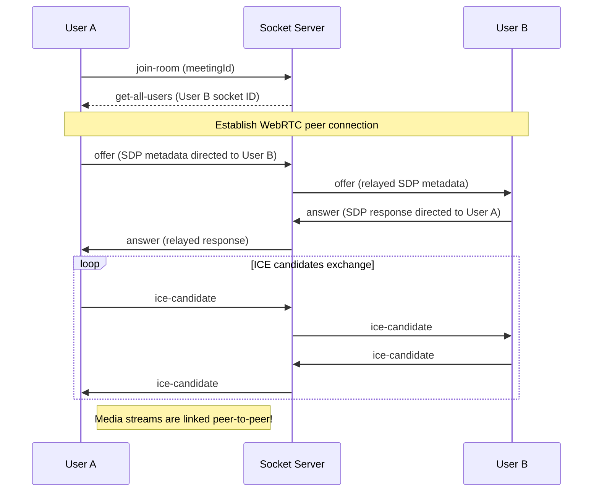

# IntellMeet 🎥🤖
### AI-Powered Enterprise Meeting & Collaboration Platform

IntellMeet is a modern, enterprise-grade collaborative meeting platform built using the MERN (MongoDB, Express, React, Node.js) stack. It supports multi-party WebRTC video conferencing, real-time workspace messaging, team collaboration, and AI-driven summary/action-item extraction.

---

## 📂 Codebase Architecture

The workspace is organized as follows:

```
ZIDIO-WEBD-PROJ/
├── README.md (Root documentation)
├── backend/                  # Refactored, security-hardened production API server
│   ├── server.js             # Main server bootstrap
│   ├── package.json          # Node dependencies & run scripts
│   ├── .env.example          # Template for backend env variables
│   └── src/
│       ├── app.js            # Express app configuration & middlewares
│       ├── config/           # Database configurations (MongoDB Connection)
│       ├── controllers/      # Route controller handlers
│       ├── middleware/       # JWT Auth verification, rate limiting, and validator interceptors
│       ├── models/           # Mongoose schemas (User, Meeting, Message, Team, etc.)
│       ├── routes/           # REST API endpoints mapping
│       ├── services/         # Third-party integrations (e.g., OpenAI API)
│       ├── socket/           # WebRTC signaling & real-time chat socket handlers
│       └── utils/            # Shared utilities & helper functions
│
└── frontend/                 # Frontend client workspace & original MERN setup
    ├── package.json          # Root workspace runner scripts
    ├── README.md             # Frontend-specific documentation
    ├── client/               # Vite-powered React client application
    │   ├── index.html
    │   ├── vite.config.js
    │   └── src/              # React components, hooks, contexts, and pages
    └── server/               # Original Express backend reference server
```

---

## 🚀 Key Features

1. **Robust Authentication**: Secure registration, login, and profile lookup using JWT cookies, HTTP-only storage, and bcrypt password hashing.
2. **Interactive Dashboard**: Quickly schedule meetings, join rooms using unique meeting keys (e.g., `abc-defg-hij`), and inspect history logs.
3. **WebRTC Video Conference**: Peer-to-peer mesh grid calling supporting real-time video/audio toggles, local audio track management, and screen sharing.
4. **Real-Time Workspace Chat**: Instant messaging, user status, typing indicators, and timestamps powered by Socket.io.
5. **AI Assistant**: Automated meeting summaries and checklist generation. Uses OpenAI `gpt-3.5-turbo` with a local rule-based mock backup parser if no API key is specified.
6. **Collaborative Spaces**: Create teams, invite collaborators by email, and edit a live synchronized shared markdown document.
7. **Premium Responsive UI**: Stunning glassmorphic dark-mode design built with Tailwind CSS v4, smooth animations, and robust loading feedback.
8. **Hardened Security Middleware**: Full Express configuration using **Helmet** headers, cors permissions, payload parsing limit constraints, and custom unified error handlers.

---

## 🛠️ Local Setup Instructions

### Prerequisites
- **Node.js**: `v18.0.0` or higher
- **MongoDB**: Local installation or a MongoDB Atlas URI

### Step-by-Step Installation

1. **Clone the repository** to your local environment.
2. **Configure Environment Variables**:
   
   - In `backend/` directory, create a `.env` file:
     ```env
     PORT=8000
     NODE_ENV=development
     MONGODB_URI=mongodb://127.0.0.1:27017/intellmeet
     JWT_SECRET=your_super_secret_jwt_key
     CORS_ORIGIN=http://localhost:5173
     OPENAI_API_KEY=your_openai_api_key
     ```
   
   - In `frontend/server/` directory (if using the legacy/reference server), duplicate `.env.example` as `.env` and fill in:
     ```env
     PORT=5000
     NODE_ENV=development
     MONGO_URI=mongodb://127.0.0.1:27017/intellmeet
     JWT_SECRET=intellmeetsecretkey
     OPENAI_API_KEY=your_openai_api_key
     ```

3. **Install Dependencies & Launch**:
   
   - **For the Hardened Backend**:
     ```bash
     cd backend
     npm install
     npm run dev
     ```
     This starts the Express server with Nodemon reloading on port `8000`.

   - **For the React Frontend & Legacy Orchestration**:
     ```bash
     cd frontend
     npm install
     npm run install-all   # Installs both server & client packages
     npm run dev           # Runs client (Vite) and reference server concurrently
     ```

---

## 🔌 Socket.io & WebRTC Signaling Workflow

The multi-party WebRTC meeting rooms establish connections using Socket.io to relay Session Description Protocol (SDP) signals and ICE Candidates:



---

## 🔒 Security Best Practices Implemented

- **HTTP Headers Management**: Helmet middleware limits script sources, prevents clickjacking, and enforces browser features policies.
- **CORS Protection**: Access is restricted to pre-configured client hosts only, preventing unauthorized requests.
- **Robust Error Boundary**: A global Express error middleware intercepts native errors, Mongoose schema validation failures, token expiration, and Mongo duplicate keys, safely converting them into standardized JSON formats without exposing production stack traces.
- **Request Size Boundaries**: Body-parsers restrict payload sizes to `16kb` to mitigate buffer overflow or Denial of Service (DoS) attempts.
